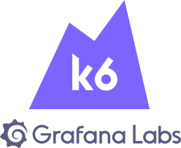

# Performance Test / Load Test with k6

Perform load testing and measure the performance of your applications using k6.

<p align="center"><a href="https://k6.io/"></a></p>
<p align="center">Modern load testing for developers and testers in the DevOps era.</p>

<br/>

<br/>

## About

This repository provides a simple collection of load testing scenarios for measuring the performance of both REST and GraphQL APIs using k6. Load testing helps you understand how your APIs behave under various levels of load, allowing you to identify potential bottlenecks and performance issues.

## Setup and Installation

To use this load testing setup, you need to have k6 installed on your machine. You can install K6 using npm:

```bash
npm install -g k6
```

## CLone this Repository and Navigate to Directory

```bash
git clone https://github.com/bogimahendra5/K6-Performance-Test.git
```

```bash
cd K6_Performance_Test
```

### Instal Project Dependencies

```bash
npm install
```

## Running Tests

- Choose a test script you want to run (e.g., rest-api-test.js or graphql-api-test.js).
- Run the test using k6:

```bash
k6 run namefile/script.js
```
